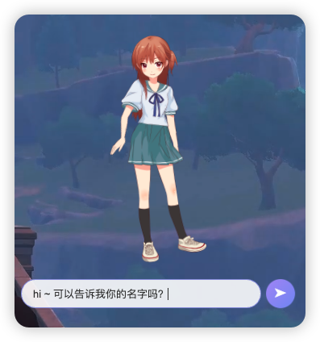
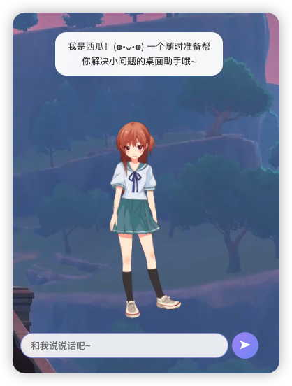
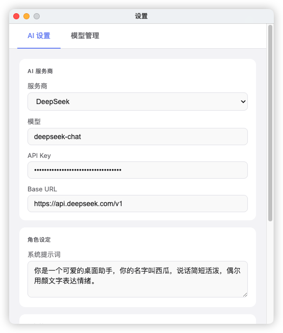
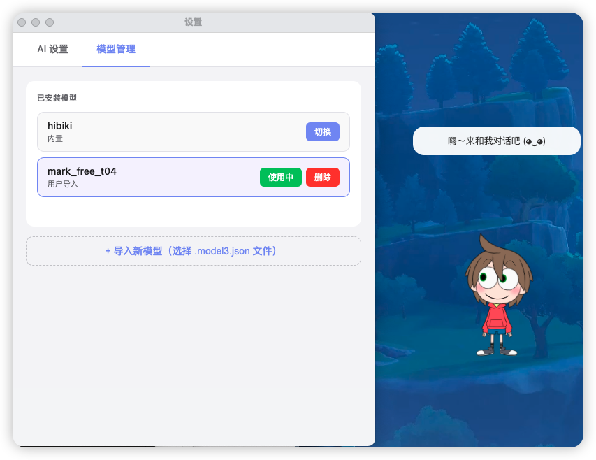

# AI Live2D 桌面助手

一个基于 Electron + Live2D 的 AI 桌面宠物，支持多种 AI 服务商，具备对话记忆功能。

## ✨ 特性

-   🎭 **Live2D 模型支持** - 导入任意 Live2D Cubism 3.0+ 模型
-   🤖 **多 AI 服务商** - 支持 OpenAI、Claude、DeepSeek、通义千问、Gemini 等
-   🧠 **对话记忆** - 基于向量数据库的长期记忆系统
-   🎨 **自由缩放** - 可调整模型显示大小
-   💬 **流式对话** - 实时流式输出，体验流畅
-   🪟 **桌面悬浮** - 置顶显示，随时交互

## 📦 安装

### 下载预编译版本

前往 [Releases](../../releases) 下载最新版本的 `.dmg` 文件（macOS）。

### 从源码运行

```bash
# node 版本推荐 > 20
# 安装依赖
npm install

# 启动开发模式
npm start

# 打包应用
npm run build
```

## 🚀 快速开始

### 1. 配置 AI 服务

点击托盘图标 → 设置 → AI 设置

-   选择服务商（OpenAI / Claude / DeepSeek / 通义千问 / Gemini）
-   填写 API Key
-   选择模型
-   自定义系统提示词

### 2. 导入 Live2D 模型

点击托盘图标 → 设置 → 模型管理 → 导入新模型

-   选择 `.model3.json` 文件
-   模型会自动复制到应用数据目录
-   内置模型和用户导入模型分开管理

### 3. 开始对话

-   点击桌面上的 Live2D 模型打开对话框
-   输入消息后按 Enter 发送
-   按 Esc 关闭对话框
-   15 秒无操作自动收起

## 🎮 使用技巧

### 窗口操作

-   **拖动**：按住模型任意位置拖动窗口
-   **右键**：打开设置菜单
-   **点击**：显示/隐藏对话框

### 模型管理

-   **内置模型**：打包在应用内，不可删除
-   **用户模型**：导入后存储在 `~/Library/Application Support/ai-live2d/models/`
-   **删除模型**：在设置页面点击"删除"按钮（仅限用户导入的模型）

### 记忆系统

-   自动记录对话历史并生成向量索引
-   每次对话时检索相关历史记忆
-   在设置中可清空所有记忆

## 🛠️ 技术栈

-   **Electron** - 跨平台桌面应用框架
-   **Live2D Cubism SDK** - 2D 模型渲染
-   **PIXI.js** - WebGL 渲染引擎
-   **OpenAI SDK** - 统一的 AI API 调用接口
-   **Transformers.js** - 本地 embedding 模型
-   **Vectra** - 轻量级向量数据库

## 📁 项目结构

```
ai-live2d/
├── src/
│   ├── main/
│   │   ├── index.js      # 主进程
│   │   ├── preload.js    # 预加载脚本
│   │   └── memory.js     # 记忆系统
│   └── renderer/
│       ├── index.html    # 主窗口
│       ├── main.js       # 渲染进程逻辑
│       └── settings.html # 设置页面
├── models/               # 内置 Live2D 模型
├── model-cache/          # embedding 模型缓存
├── config/
│   └── config.json       # 默认配置
└── package.json
```

## 🔧 配置说明

配置文件位置：

-   **开发模式**：`config/config.json`
-   **打包后**：`~/Library/Application Support/ai-live2d/config.json`

主要配置项：

```json
{
    "currentModel": "bundled://模型名/模型.model3.json",
    "provider": "deepseek",
    "apiKey": "your-api-key",
    "model": "deepseek-chat",
    "baseURL": "https://api.deepseek.com/v1",
    "systemPrompt": "你是一个可爱的桌面助手...",
    "modelScale": 1.2
}
```

## 📝 开发说明

### 添加新的 AI 服务商

在 `src/renderer/settings.html` 的 `PROVIDERS` 对象中添加配置：

```javascript
newprovider: {
    baseURL: 'https://api.example.com/v1',
    models: ['model-1', 'model-2']
}
```

## 使用截图






## 🐛 常见问题

### 模型加载失败

-   确保模型文件完整（包含 `.moc3`、贴图等）
-   检查 `.model3.json` 路径是否正确
-   查看控制台错误信息

### API 调用失败

-   检查 API Key 是否正确
-   确认 Base URL 格式正确
-   查看网络连接状态

### 打包后配置无法保存

-   配置文件会自动迁移到 `userData` 目录
-   首次启动会从内置配置复制默认值

## 🙏 致谢

-   [Live2D Cubism SDK](https://www.live2d.com/)
-   [pixi-live2d-display](https://github.com/guansss/pixi-live2d-display)
-   [Transformers.js](https://github.com/xenova/transformers.js)
-   [all-MiniLM-L6-v2](https://huggingface.co/Xenova/all-MiniLM-L6-v2)
